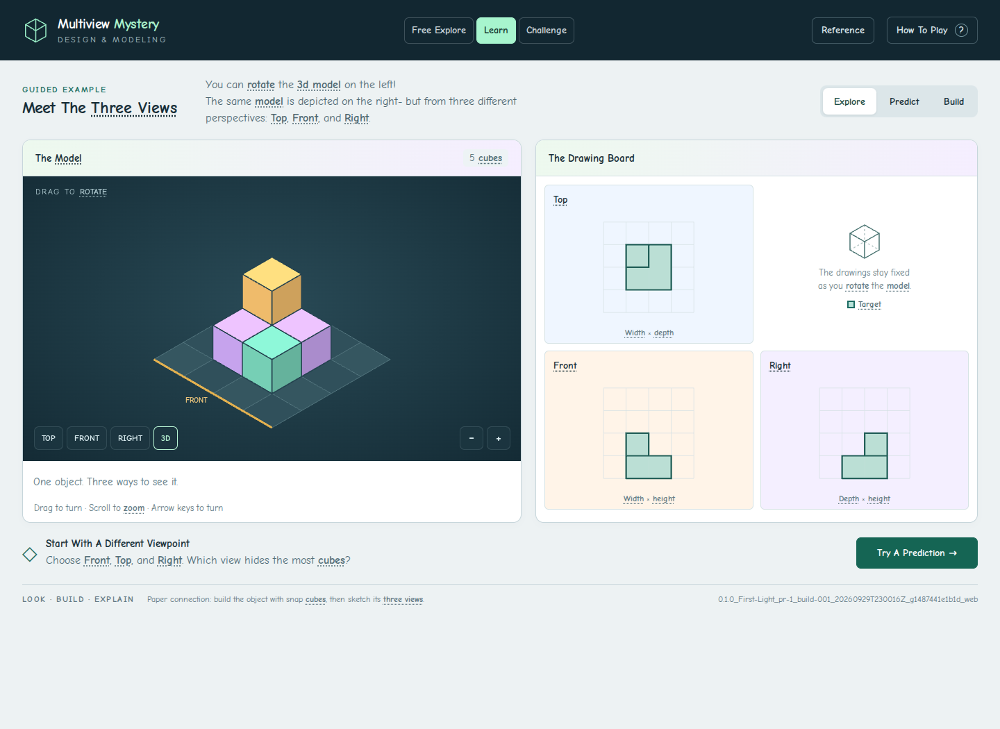
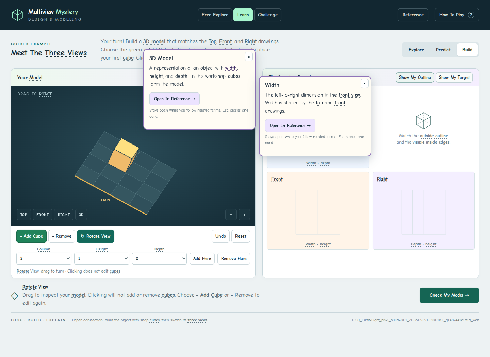

# Review And Verification

September 29, 2026. Review branch; not merged or deployed.

- 167 spatial, puzzle, input-math, matching, and local-asset checks passed.
- 41 browser assertions passed. Browser playthrough: all six activities completed through UI controls; rotate
  inspection, four target/outline combinations, separate free construction,
  nested definitions, reference search, challenge target protection, and accurate
  final completion were checked.
- Desktop and phone layouts were inspected, including nested reference cards.
- Comic Sans is requested throughout; this Linux review uses bundled Comic Neue
  because Microsoft Comic Sans is not installed.
- The existing 3D-coordinate Canvas renderer is retained; this is not a WebGL
  lighting/material upgrade.
- Curricular mapping remains provisional until the missing DM 1.2/2.1 goals
  documents are authored and reviewed. This is recorded in CURRICULAR-MAPPING.md.

## Identified Review Build

`0.1.0_First-Light_pr-1_build-001_20260929T230016Z_g1487441e1b1d_web`

[GitHub Build And Download](https://github.com/AbbyUsesAIThatCodes/MultiviewMystery/actions/runs/36642790359)
· [Manifest](review/2026-09-29/build-manifest.json)
· [Browser Results](review/2026-09-29/browser-results.json)

The downloaded CI artifact was played through directly. Its source files match
PR head `bc81ef1d4c8ffe7f5e8b84f7b7ba0ce88083507c` byte-for-byte (the HTML footer
is intentionally injected). The manifest, named artifact, visible footer, and
build report agree. Touch nested definitions and Alt+Down definitions on action
controls were exercised. Two concurrent local builds reserved distinct ordinals.
Reopening the CI artifact preserved its identity. The commit adding this evidence
changes tests and documentation only; it does not rebuild or relabel this artifact.

## Review Screenshots

[Learn On Desktop](review/2026-09-29/learn-desktop.png) ·
[Build On Phone](review/2026-09-29/build-phone.png) ·
[Nested Definitions](review/2026-09-29/nested-reference.png) ·
[Final Model](review/2026-09-29/final-model.png)

The graphics companion is [EdugamesGraphicsStorage PR 1](https://github.com/AbbyUsesAIThatCodes/EdugamesGraphicsStorage/pull/1).
Both PRs remain unmerged. The graphics pack preserves original and current
procedural sources with source revisions, licenses, and complete checksums.
