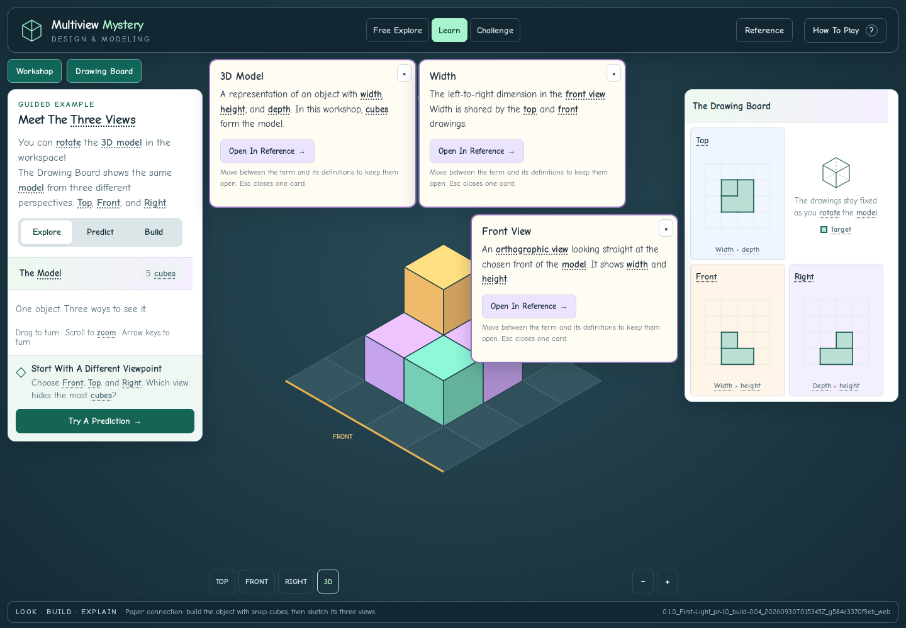

# Review And Verification

Issue #4 And The Tooltip Follow-Up. September 30, 2026 (UTC).
PR #10 is stacked on PR #9; review branch only, not merged or deployed.

## Result

The reused main action kept a stale 3D Model vocabulary annotation after its
label changed to Check Construction. Action buttons now never open definitions,
including nested labels, focus, keyboard shortcuts, and touch. Existing stale
annotations are removed when content is decorated.

- Definitions prefer nearby free space outside panels, action controls, and
  earlier cards. Their position stays fixed while reading instead of chasing
  the pointer. Scrolling a short card keeps its size and position stable.
- Hover opens after 220 ms, with a 120 ms fade. A 300 ms travel grace period lets
  students reach the card. Leaving the family fades it and its descendants away;
  hovering a descendant preserves all its ancestors. Returning to a parent
  dismisses abandoned children. Fading cards cannot intercept input.
- Keyboard focus and touch keep cards available without hovering. Escape closes
  one level and restores trigger focus. Outside taps and explicit close controls
  remain available. A stationary pointer cannot dismiss a keyboard-open card.
- Reduced motion removes fades. Reference text, nested terms, accessible control
  names, and searchable Reference navigation remain available.

## Verified Build

`0.1.0_First-Light_pr-10_build-004_20260930T015345Z_g584e3370f9eb_web`

[Passing GitHub Review](https://github.com/AbbyUsesAIThatCodes/MultiviewMystery/actions/runs/36657265923)
· [Download Review Artifact](https://github.com/AbbyUsesAIThatCodes/MultiviewMystery/actions/runs/36657265923/artifacts/11073097934)
· [Saved Build ZIP](review/issue-4/0.1.0_First-Light_pr-10_build-004_20260930T015345Z_g584e3370f9eb_web.zip)
· [Manifest](review/issue-4/build-manifest.json)
· [Verification Record](review/issue-4/verification.json)

The saved ZIP contains the exact tested CI build and its original manifest and
build report. It is repackaged, not rebuilt or relabeled. The folder, console,
manifest, visible footer, three browser reports, and build report agree.
Runtime files match reviewed head `7bfd54b195953c0364ff7da375860cc26f655816`
byte-for-byte except for the intentional HTML build-ID injection. The complete
source fingerprint also matches. The manifest records the actual CI merge
revision `584e3370f9eb1bc522e9844bdc5b82a967eb0525`.

## Checks

- **167** logic, spatial, alternative-solution, and local-asset checks.
- **74** focused tooltip assertions: the reported Check Construction sequence;
  stale and nested action labels; 13 representative action controls; unobstructed
  first click, keyboard activation, and tap; desktop panel avoidance; three-level
  hover ancestry; travel grace and fade dismissal; keyboard focus restoration;
  stationary-pointer behavior; reduced motion; nested Reference text; real touch
  at 390×844 and 320×568; stable card scrolling and working Reference links.
- **629** workspace assertions across 1440×900, 1280×720, 390×844, 320×568, and
  844×390: all modes, viewport geometry, scrolling, panel controls, scene input
  separation, actual touch edits, predictions, and stable build identity.
- **41** existing browser assertions: all six activities completed through
  controls, alternative UI states, target protection, reference navigation,
  keyboard/touch access, completion accuracy, and reduced motion.
- **911 total checks passed; no browser page errors.** Syntax checks pass.
- Desktop nested definitions, Check Construction, both portrait phone sizes,
  and landscape screenshots inspected. On narrow phones definitions may overlap
  each other; shorter internally scrollable cards preserve access to controls.
- CI builds 001–004 retain distinct reserved identities. Earlier failures exposed
  stationary-pointer, card-scrolling, and tiny-phone placement cases addressed
  in build 004. The final documentation/evidence commit does not rebuild it.

[Tooltip Results](review/issue-4/tooltip-results.json)
· [Workspace Results](review/issue-4/workspace-results.json)
· [Existing Browser Results](review/issue-4/browser-results.json)

## Screenshots

[Check Construction](review/issue-4/check-construction-safe.png) ·
[Desktop Family](review/issue-4/nested-family-desktop.png) ·
[Phone Family](review/issue-4/nested-phone-390.png) ·
[Small Phone](review/issue-4/root-phone-320.png) ·
[Small Phone Family](review/issue-4/nested-phone-320.png) ·
[Landscape](review/issue-4/landscape.png)



## Try This Build

Download and extract the review artifact. If the previous server is running,
stop it with Ctrl+C. Open a terminal in the new `builds/<full-build-id>` folder
containing `index.html`, then run:

```sh
py -m http.server 8000
```

On macOS/Linux use `python3` instead of `py`. Open http://localhost:8000 and refresh.
The footer should show PR 10, build 004. A refresh clears in-memory progress.

1. Choose Free Explore, add a cube, and click Check Construction once. Its result
   should appear immediately, without a definition opening.
2. In Learn, hover 3D Model in the instructions, then Width in its card, then Front
   View in the child. Move into the grandchild: all ancestors stay open.
3. Return to the first card: the abandoned children fade away. Move outside the
   entire family: all remaining cards fade away after a brief travel grace.
4. Tab to a vocabulary term and press Enter; use Escape to return one level.
   On touch, tap terms and scroll short cards to reach Open In Reference.

## Handoff

PR #10 targets the unmerged PR #9 branch. Review order remains #1 → #9 → #10;
retarget each dependent PR after its predecessor is accepted. The teacher's
reported blocker authorized this focused tooltip fix ahead of the classroom
scene (#3). Issues #3 and #5–#8 remain separate. No merge or deployment occurred.

Panel avoidance is best effort when screen space is limited; action controls
receive the highest placement priority. Keyboard and touch do not depend on
unhovering. Existing renderer, puzzles, curricular-audit gaps, and offline assets
are unchanged by this task.

[Prior PR #9 Review](REVIEW-PR-9.md) · [Prior PR #1 Review](REVIEW-PR-1.md) ·
[Short Checkpoint](ISSUE-4-CHECKPOINT.md)
