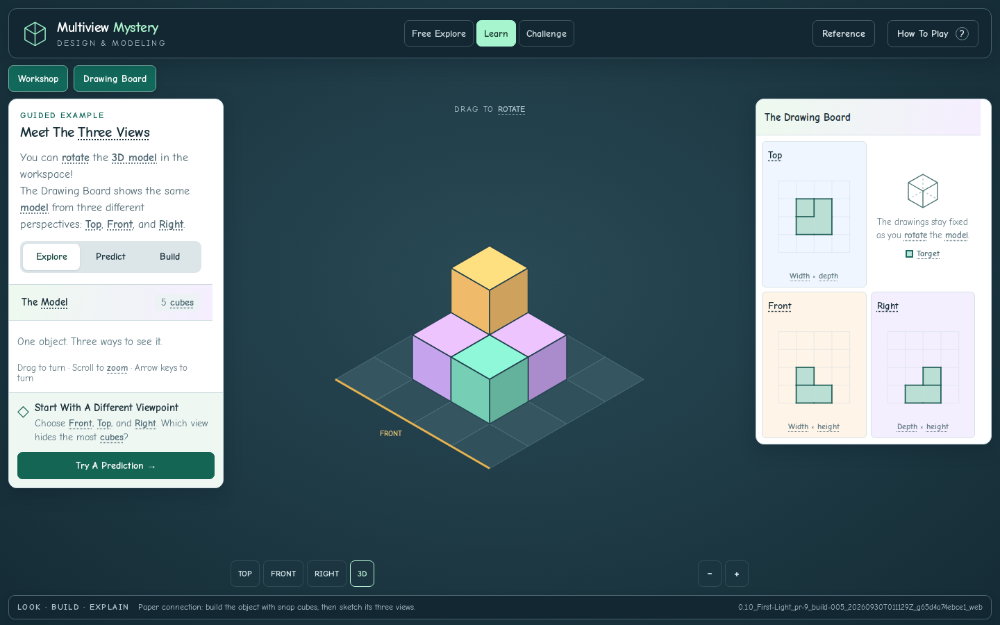

# Review And Verification

Issue #2: Full-Viewport Workspace And Floating Panels. September 29, 2026
(America/New_York). Review branch only; not merged or deployed.

## Result

- Full-browser scene with the existing palette and Comic Sans / Comic Neue typography.
- Independent floating Workshop and Drawing Board panels on desktop, switchable
  bottom panels on portrait phones, and a side panel on landscape phones.
- Hide/show controls and camera framing that follows the unobstructed scene area.
- Scrollable instructions, predictions, progress, tools, feedback, and drawings;
  essential controls remain reachable with mouse, keyboard, and touch.
- Panel interactions do not rotate, zoom, add, or remove cubes in the scene.
- Free Explore, Learn, Challenge, alternative solutions, and fixed top/front/right
  drawing conventions retained. The short Explore/Prediction instructions now
  name the workspace and panels instead of relying on left/right/below placement.

## Verified Build

`0.1.0_First-Light_pr-9_build-005_20260930T011129Z_g65d4a74ebce1_web`

[Passing GitHub Review](https://github.com/AbbyUsesAIThatCodes/MultiviewMystery/actions/runs/36653913240)
· [Saved Build ZIP](review/issue-2/0.1.0_First-Light_pr-9_build-005_20260930T011129Z_g65d4a74ebce1_web.zip)
· [Manifest](review/issue-2/build-manifest.json)
· [Verification Record](review/issue-2/verification.json)

The saved ZIP contains the exact downloaded CI build, including its original
manifest and build report. Repackaging does not create or relabel a build.
The artifact folder, console, embedded manifest, visible footer, both browser
reports, and build report agree. Runtime source files match reviewed head
`e09bf52c0cb918852bca54e2835aa423fed592b3` byte-for-byte, apart from the intentional build-ID injection
in HTML. The manifest records the actual CI merge revision `65d4a74ebce119a9b3b4d5b2721af89f28e7f094`.

## Checks

- **167** spatial, puzzle, input-math, alternative-solution, and local-asset checks.
- **629** workspace assertions: all three modes at 1440×900, 1280×720, 390×844,
  320×568, and 844×390; full canvas coverage; no page overflow; reachable panel
  controls/drawings; camera and panel separation; header labels; viewport changes;
  actual touch placement/removal; panel switching; prediction; stable build ID.
- **41** existing browser assertions: all six activities completed via controls;
  overlay combinations; separate free construction; challenge target protection;
  nested/reference navigation; keyboard and touch; accurate completion; reduced motion.
- **837 total checks passed; no browser page errors.** Syntax checks also pass.
- Desktop, portrait, small-phone, landscape, and prediction screenshots inspected.
  Drawing content scrolls on phones; the fixed top/front/right arrangement remains intact.
- CI builds 001–005 have distinct reserved identities. Download/reload preserves
  identity. The final evidence-only commit does not rebuild or relabel build 005.

[Workspace Results](review/issue-2/workspace-results.json)
· [Existing Browser Results](review/issue-2/browser-results.json)

## Screenshots

[Desktop](review/issue-2/desktop.png) ·
[Phone Workshop](review/issue-2/phone-workshop.png) ·
[Phone Drawings](review/issue-2/phone-drawings.png) ·
[Landscape](review/issue-2/landscape.png) ·
[Small Phone](review/issue-2/small-phone.png) ·
[Phone Prediction](review/issue-2/phone-prediction.png)

## Handoff

PR #9 is stacked on the still-open PR #1. Merge/accept #1 first, then retarget
#9 to main for review. Neither has been deployed by this task. The classroom
scene (#3) and button/reference/camera follow-ups (#4–#8) remain separate.

The existing 3D-coordinate Canvas renderer is retained. Linux screenshots use
bundled Comic Neue because Microsoft Comic Sans is not installed. Existing
curricular-audit gaps remain as recorded in CURRICULAR-MAPPING.md.

[Prior PR #1 Review](REVIEW-PR-1.md) · [Short Checkpoint](ISSUE-2-CHECKPOINT.md)
