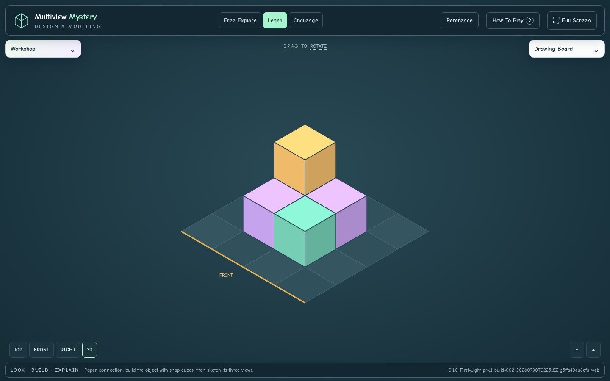

# Review And Verification

Compact Controls And Fullscreen. September 30, 2026 (UTC).
PR #11 addresses issues #6 and #7 and the September 29 follow-up requesting
fullscreen and collapsible panel headers. Review only; not merged or deployed.

## Result

- **+ Add Cube** and **− Remove Cube** share one active state and matching styles.
  Only the selected tool is green; a checkmark and `aria-pressed` identify it
  without relying on color. Selection remains accurate after edits, reset, undo,
  and mode changes.
- **Rotate View** is removed. Drag with either editing tool to turn the scene;
  releasing a drag does not edit cubes. A deliberate click/tap performs the
  selected edit. Named camera views, keyboard rotation, and zoom remain.
- **Full Screen** enters native browser fullscreen; **Exit Full Screen** or the
  browser's exit command returns to the window. The control follows actual
  fullscreen state. Unsupported browsers retain the full-window workspace;
  rejected requests show feedback without stopping gameplay.
- **Workshop** and **Drawing Board** now contain their own collapsible headers.
  The separate panel toolbar is removed. Headers stay available while contents
  scroll and when folded. Desktop panels open independently; compact layouts
  show one body at a time. Collapsing expands the scene's framing and preserves
  the construction, lesson state, and selected tool.

## Verified Build

`0.1.0_First-Light_pr-11_build-002_20260930T022518Z_g5ffa40ea8efa_web`

[Passing CI](https://github.com/AbbyUsesAIThatCodes/MultiviewMystery/actions/runs/36659754969)
· [Download Review Artifact](https://github.com/AbbyUsesAIThatCodes/MultiviewMystery/actions/runs/36659754969/artifacts/11073403783)
· [Saved Build ZIP](review/compact-controls/0.1.0_First-Light_pr-11_build-002_20260930T022518Z_g5ffa40ea8efa_web.zip)
· [Manifest](review/compact-controls/build-manifest.json)
· [Verification Record](review/compact-controls/verification.json)

The saved ZIP repackages the exact tested output, retaining its original manifest
and report. Folder name, console, manifest, visible footer, four browser reports,
and build report agree. Runtime bytes match reviewed head
`950273282c16f3bf54f4d7739dc95168152b8d74`, apart from the intended HTML identity
injection; the complete source fingerprint also matches. The manifest records
CI merge revision `5ffa40ea8efa433ffd697d906b864e92c0eaf955`.

## Checks

**1,080 checks passed, with no browser page errors.** Syntax checks also pass.

| Suite | Checks | Coverage |
| --- | ---: | --- |
| Logic | 167 | Puzzle rules, projections, alternative solutions, picking, camera math, local assets |
| Controls | 138 | Shared colors/checkmark/state, reset/undo, real mouse and touch drags and deliberate edits with both tools in all three modes, keyboard collapse, phone panel switching, native fullscreen entry/exit, browser-driven exit, rejection and unsupported-browser fallback |
| Tooltips | 74 | Check Construction, action exclusions, nesting, hover lifetime, keyboard focus, reduced motion, touch, scrolling, Reference navigation |
| Workspace | 659 | All modes at 1440×900, 1280×720, 390×844, 320×568, and 844×390; reachable headers/content, scrolling, scene input separation, camera framing, actual touch edits, predictions, stable identity |
| Playthrough | 42 | All six activities completed, completion accuracy, target protection, reference access, phone interaction, reduced motion |

[Controls Results](review/compact-controls/controls-results.json) ·
[Tooltip Results](review/compact-controls/tooltip-results.json) ·
[Workspace Results](review/compact-controls/workspace-results.json) ·
[Playthrough Results](review/compact-controls/browser-results.json)

Desktop fullscreen, folded panels, phone editing tools, 320-pixel Workshop and
Drawing Board layouts, landscape, and the tooltip regression screenshots were
inspected. Small-screen contents remain scrollable. The first build passed the
main interactions; its fullscreen-denial test setup was corrected before this
complete passing run. Builds 001 and 002 retain their distinct reserved IDs.
The final documentation/evidence commit does not rebuild or relabel build 002.

## Screenshots

[Fullscreen And Tool Selection](review/compact-controls/fullscreen-desktop.png) ·
[Collapsed Desktop](review/compact-controls/collapsed-desktop.png) ·
[Phone Tools](review/compact-controls/tools-phone.png) ·
[Small Phone Workshop](review/compact-controls/small-phone-workshop.png) ·
[Small Phone Drawings](review/compact-controls/small-phone-drawings.png) ·
[Landscape](review/compact-controls/landscape.png) ·
[Nested Tooltips](review/compact-controls/nested-tooltips.png)

## Try This Build

Extract the review artifact. Stop an old local server with Ctrl+C. Open a terminal
in the new `builds/<full-build-id>` folder containing `index.html`, then run
`py -m http.server 8000` (or `python3 -m http.server 8000` on macOS/Linux).
Refresh http://localhost:8000 and confirm **PR 11, build 002** in the footer.

1. In Free Explore, switch between Add Cube and Remove Cube. Only the selected
   button should be green and checked.
2. Click/tap to edit, then drag a cube face with each tool selected. Rotation
   should leave the cube count and tool selection unchanged.
3. Fold and reopen each panel using its header. Both headers remain available;
   the model and lesson state stay intact.
4. Enter Full Screen, try the tools and Reference, and exit again.

## Handoff

PR #11 is stacked on unmerged PR #10. Review order remains #1 → #9 → #10 → #11;
retarget each dependent PR after its predecessor is accepted. Latest teacher
instructions authorize this combined controls pass ahead of remaining issues
#3, #5, and #8. No merge or deployment occurred. Existing curricular-audit gaps
and offline assets are unchanged.

[Prior PR #10 Review](REVIEW-PR-10.md) ·
[Short Checkpoint](COMPACT-CONTROLS-CHECKPOINT.md)
